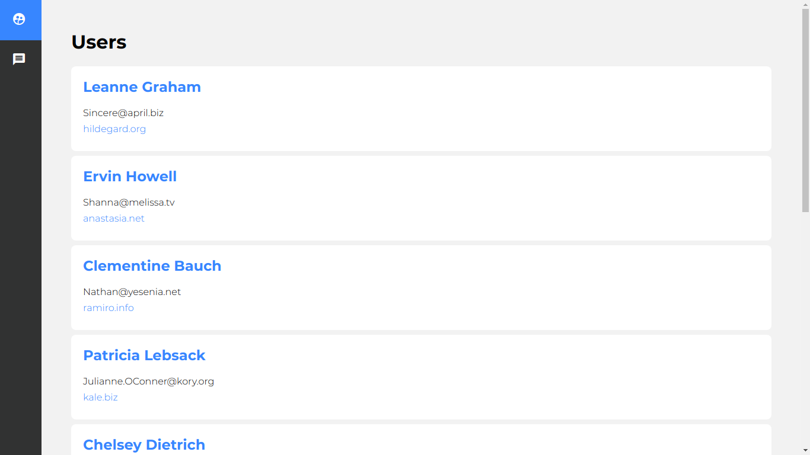

# Tutorial

Esta aplicação foi desenvolvida seguindo 
 [esse tutorial](https://coursetro.com/posts/code/154/Angular-6-Tutorial---Learn-Angular-6-in-this-Crash-Course).

# Build de produção

Disponivel para uso em: [http://yuri8p.github.io/ng6/](http://yuri8p.github.io/ng6/)

Para fazer o deploy no github pages de uma aplicação Angular que utiliza rotas é necessário fazer o seguinte:

1. Gerar o build de produção especificando:
    - `--prod` para gerar arquivos de produção menores; 
    - `--base-href` com o **/nome-do-repositorio/** entre barras;
    - `--output-path` como **docs** para facilitar a configuração do github pages;
    - Exemplo: `ng build --prod --output-path docs --base-href /ng6/`
2. Fazer uma cópia do `docs/index.html` como `docs/404.html` para que as rotas funcionem em servidores estáticos.
3. Configurar o `Source` do `Github Pages` como `master branch /docs folder` nas configurações do seu repositório. **https://github.com/seu_usuario/repositorio/settings**
4. Salvar as configurações e acessar a url do projeto no Github Pages.

- Caso prefira fazer o deploy em servidores php, o servidor built-in do php já faz o redirecionamento de rotas para o index automaticamente. Para quem usa o apache, é necessário configurar a opção de redirecionamento 404 no htaccess ou em um arquivo de virtualhost como o `/var/apache2/sites-available/000-default.conf`.
A opção é a seguinte: `ErrorDocument 404 /404.html`.

# Screenshot

